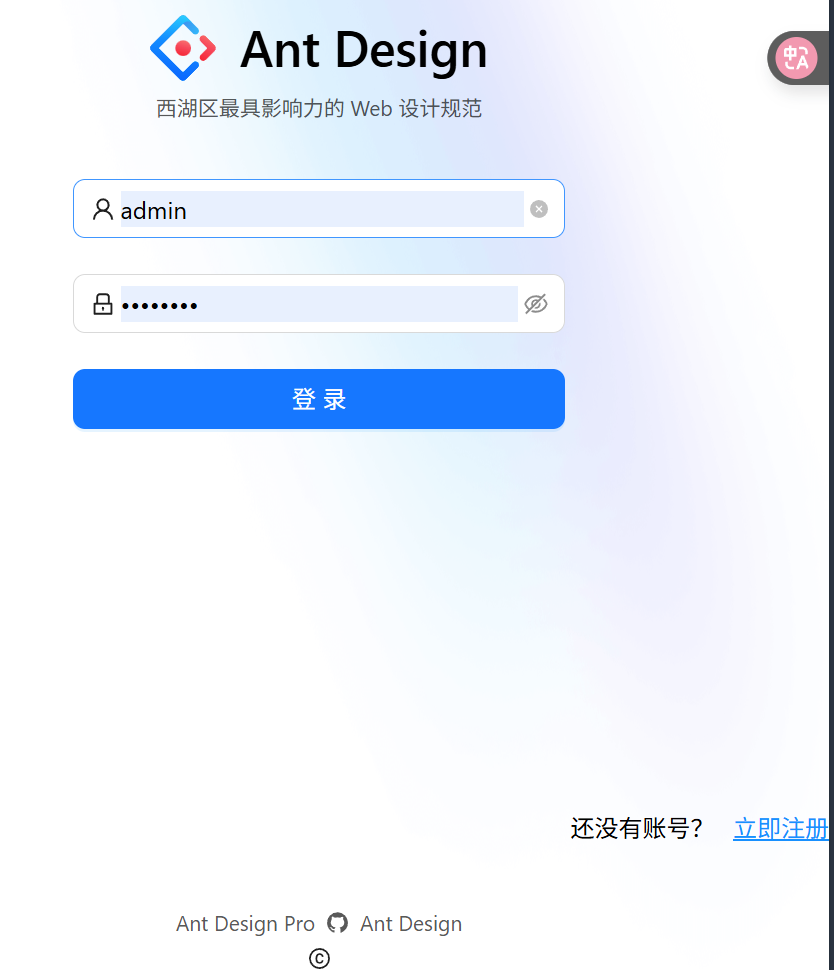
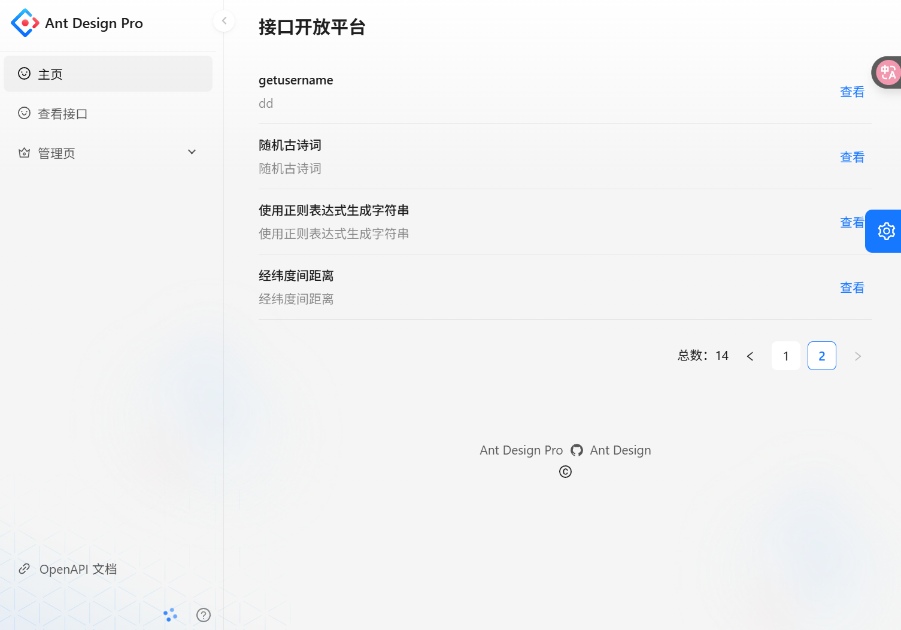
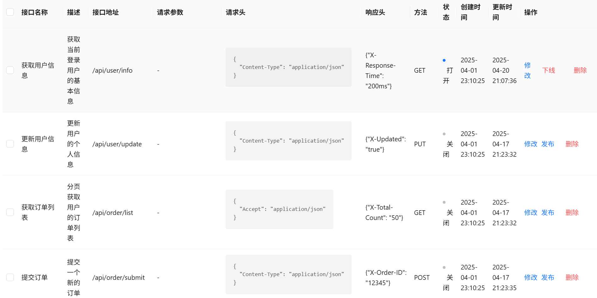
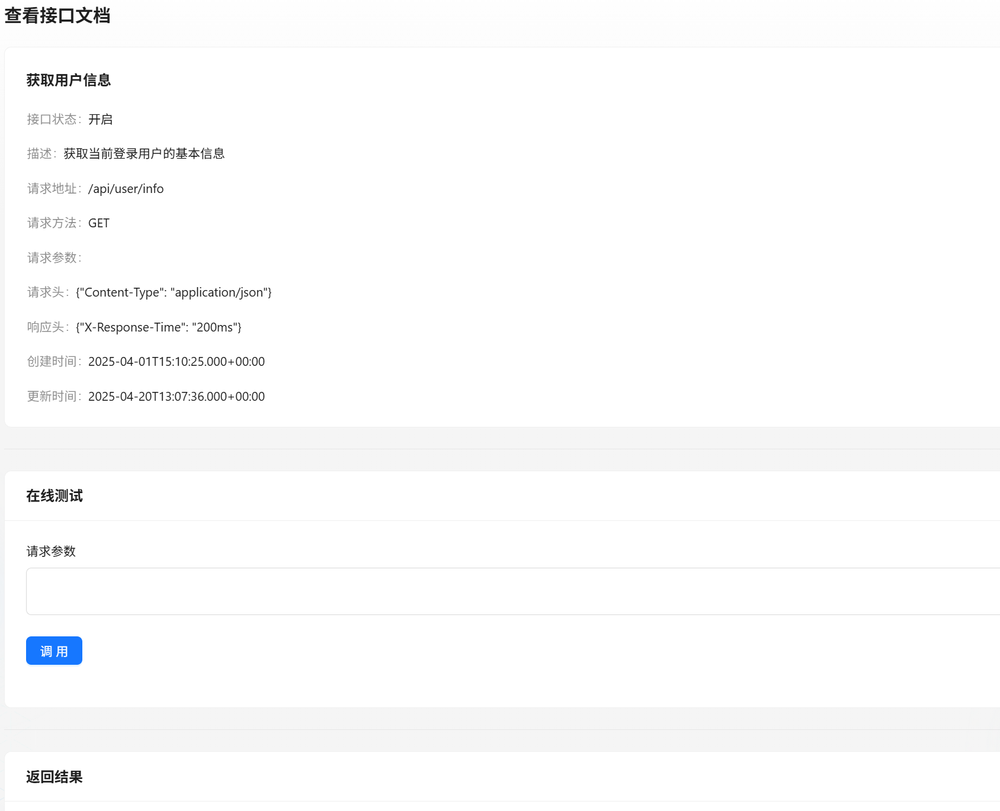
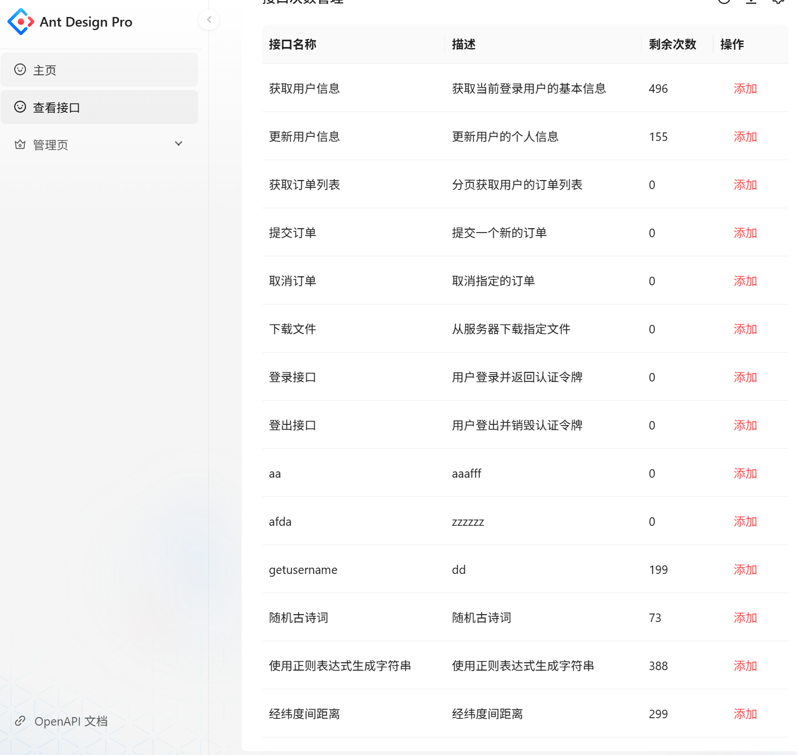
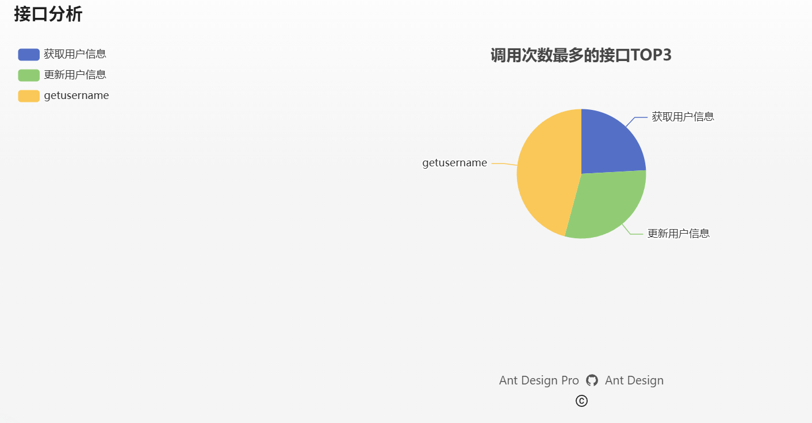
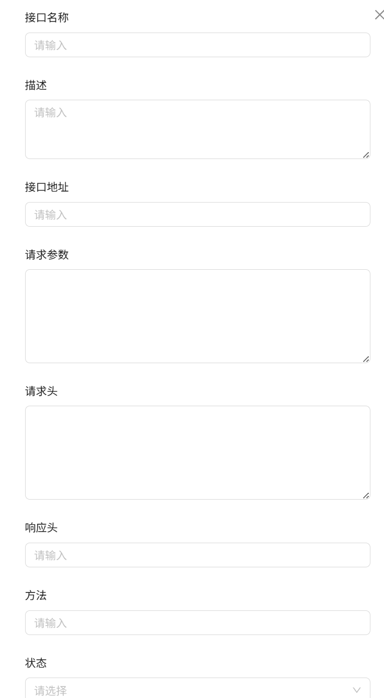

# OpenAPI API 开放平台

## 技术选型

### 前端
- React 18
- Ant Design Pro 5.x 脚手架
- Ant Design & ProComponents 组件库
- Umi 4 前端框架
- OpenAPI 前端代码生成

### 后端
- Java Spring Boot
- MySQL 数据库
- MyBatis-Plus 及 MyBatis X 自动生成
- API 签名认证（HTTP 调用）
- Spring Boot Starter（用于 SDK 开发）
- Dubbo 分布式框架（支持 RPC、集成 Nacos 注册中心）
- Swagger + Knife4j 接口文档生成
- Spring Cloud Gateway 微服务网关
- 工具类库：Hutool、Apache Commons Utils、Gson 等

---

## 功能模块划分

### 🧩 一、用户管理模块（User Management）

#### 功能点：
1. 用户注册
2. 注册时随机生成 `Access Key (ak)` 和 `Secret Key (sk)`

---

### 🧩 二、接口管理模块（API Management）

#### 功能点：
1. 接口的增删改查（CRUD）
2. 接口上下线管理
3. 接口详情配置（如路径、方法等）

---

### 🧩 三、网关模块（API Gateway）

#### 功能点：
1. 请求路由转发
2. 签名校验
  - 使用随机数、时间戳及 body 内容进行 MD5 加密，防止重放攻击
3. 查询数据库中用户的 `sk` 来比对签名
4. 使用 Spring Cloud Gateway 提供的令牌桶算法实现限流
5. 权限校验：判断用户剩余调用次数 > 0
6. 调用日志记录

#### 技术实现：
- 使用 Spring Cloud Gateway 实现网关功能
- Dubbo 调用后端用户服务获取 `sk` 和调用次数

---

### 🧩 四、SDK 模块（Client SDK）

#### 功能点：
- 提供给开发者使用的客户端 SDK
- 自动封装签名逻辑（MD5 + ak/sk）
- 支持接口在线调用测试

#### 技术实现：
- 使用 Hutool 的 `JsonUtil` 进行 JSON 转换
- 使用 `HttpRequest` 发送 HTTP 请求

---

### 🧩 五、接口调用统计模块（Statistics & Monitoring）

#### 功能点：
- 接口调用次数统计
- 使用 `CompletableFuture` 实现异步计数更新
- 前端使用 ECharts 展示调用趋势图（如 Top 接口、每日调用统计等）

---

### 🧩 六、权限与配额管理模块（Permission & Quota）

#### 功能点：
- 控制用户接口调用次数
- 配合网关模块，在每次调用前检查剩余调用次数

---

## ✅ 总结：系统功能结构图（模块划分）

| 模块名称       | 负责功能                           |
| -------------- | ---------------------------------- |
| 用户管理模块   | 注册登录、生成 AK/SK               |
| 接口管理模块   | 接口 CRUD 与上下线                 |
| 网关模块       | 路由转发、签名验证、限流、权限校验 |
| SDK 模块       | 提供客户端调用工具                 |
| 统计模块       | 接口调用次数统计与图表展示         |
| 权限与配额模块 | 控制用户调用次数                   |

---
# 前端页面截图

以下为系统各功能模块的前端页面截图及简要说明：

---
## 登录页

    
    
用户身份认证入口，包含用户名、密码输入框及登录/注册按钮。

## 首页 / 主页

    
    
系统主界面，通常包括导航菜单、快捷入口和数据概览。

## 接口管理页

    
    
用于对接口信息进行查看、编辑、删除等操作的页面。

## 接口调用页

    
    
展示接口信息, 输入请求参数，在线调用。

## 调用次数统计页

    
    
用于监控接口使用次数, 可添加次数。

## 数据分析页

    
    
可视化展示接口调用top3。

## 新增 & 修改页

    
    
用于创建或编辑数据的通用表单页面，支持字段校验与提交。

